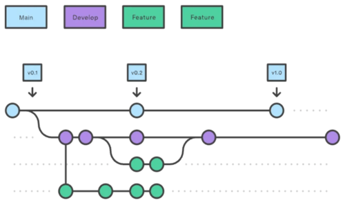

# Проект із дисципліни «Аналіз Великих даних»

## Мета

- Набути навичок роботи із популярним фреймворком Apache Spark.
- Практика створення запитів до розподілених даних за допомогою SQL
- Робота з Великими даними із відкритих джерел
- Практичні навики роботи з популярними менеджерами сховища GitLab або Github.
- Набути досвіду командної роботи в галузі аналізу Великих даних

## Завдання

### Підготовчий етап

1. Встановити PySpark.

1. Створити репозиторій Git на GitLab або Github. Переконайтесь, що він загальнодоступний або доступний за електронною поштою викладача (<volodymyr.m.shymanskyi@lpnu.ua>). Будь ласка, використовуйте інформативні назви для свого сховища (наприклад, **imdb-spark-project**).

1. Створіть 2 гілки: головну (майстер) і розробку (від основної). Він створений для командної роботи та подвійної перевірки. У майбутньому ви створюватимете свої гілки для кожної невеликої частини функціональності з розробки та створюватимете запити на злиття для розробки.

    

1. Створити локальний проект.

1. Додайте файл .gitignore.

1. Завантажте обраний датасет на ПК у зовнішню папку по відношенню до проекту.

1. Попередньо перегляньте набір даних. Визначіть з яким типом даних будете працювати, яка інформація буде корисною, а яка ні.

### Етап налаштування

#### інструкція з використанням docker

1. Встановити докер, якщо його немає. <https://docs.docker.com/get-docker/>

1. Запустити застосунок. Перевірте в терміналі, що все працює командою

    ```bash
    docker --version
    ```

    або:

    ```bash
    docker run hello-world
    ```

1. Додати в корінь директорії файл <https://drive.google.com/file/d/1l2r1KPCzCm2fEYTkrnFKDmOjWK1suGd3/view?usp=sharing>.

1. Перевірте, що у вашому проекті є файл main.py в кореневій директорії, який буде точкою входу у вашу програму .

1. У терміналі PyCharm/VSCode прописуємо команду

    ```bash
    # тут крапка - це важка частина команди
    docker build -t my-spark img .
    ```

1. Після цього використовуйте кожного разу команду `docker run my-spark-img` для запуску вашої програми. Застосунок docker при цьому тримайте відкритим.

#### інструкція з використанням install python

1. Встановити Python. (Рекомендована версія Python 3.8). <https://www.python.org/downloads/>

1. Встановити PyCharm або VSCode.

1. Налаштуйте PySpark. Виберіть установку Java 8 або 11. <https://www.datacamp.com/tutorial/installation-of-pysark>.

1. Відкрийте IDE (**PyCharm** або **VSCode**).

1. Виконайте команду `pip install pyspark` в терміналі.

1. Створіть файл main.py. Спробуйте створити тестовий **DataFrame** і застосувати до нього метод **.show()**. Якщо ваші дані відображаються належним чином, продовжуємо! Ми можемо рухатися вперед!

### Етап видобування

1. Створіть відповідні схеми для набору даних.

1. Використовуючи створені схеми, створіть відповідні **DataFrame** зчитуючи дані з ПК.

1. Перевірте чи коректно все зчиталось будь-якою дією над **DataFrame**

1. Створіть модуль та відповідну функцію у ньому для цієї операції.

### Етап трансформації

1. Отримайте загальну інформацію про набір даних. (Наприклад, схема, кількість стовпців, рядків тощо). Опишіть набір даних використовуючи цю інформацію.

1. Отримати статистику щодо числових стовпців. Провести аналіз отриманої інформації.

1. Придумати **6 власних бізнес-питань** до даних.

    *Наприклад, отримати всі назви фільмів, які доступні українською мовою.*

    Під час формування бізнес-питань, врахуйте, що має бути:

    - не менше **3 питання** де використовується **filters**
    - не менше **2 питання** де використовується **join**
    - не менше **2 питання** де використовується **group by**
    - не менше **2 питання** де використовується **window functions**

### Етап аналізу даних

1. На цьому етапі необхідно побудувати регресійну та класифікаційну модель у PySpark для обраного набору даних.

1. Потрібно виконати попередню обробку даних.

1. Обрати мінімум 3 різні моделі для задач регресії та класифікації.

1. Здійснити навчання моделей та провести аналіз процесу навчання та оцінити якість побудованих моделей.

1. Виконати оцінку якості моделей:

   - для регресії: RMSE, R²;

   - для класифікації: Accuracy, Precision, Recall, F1-score.

1. Порівняти результати для різних алгоритмів.

### Етап запису результатів

1. Запишіть отримані відповіді на бізнес-питання у файли .csv. Не додавайте результуючу папку до репозиторію (додайте папку даних до .gitignore)

### Набори даних

У вас є можливість виконувати проект над власним набором даних, що знаходиться у відкритих джерелах, або обрати один із пропонованих нижче наборів даних. Якщо Ви оберете працювати із власним набором даних, Ви повинні попередньо узгодити його із викладачем, вимоги до нього є наступні: розмір -- не менше 1 Gb, кількість колонок не менше 20, типи файлів -- csv, tsv, parquet, avro.

### Пропоновані набори даних

1. NYC taxi dataset.

   - Data and description (has to be unpacked) <https://archive.org/details/nycTaxiTripData2013>

2. IMDB dataset.

   - Data (no need for unpacking) <https://datasets.imdbws.com/>

   - Description (<https://developer.imdb.com/non-commercial-datasets/>)

3. Yelp dataset.

   - Data (1 - JSON, not Photos; 2 - has to be unpacked) <https://business.yelp.com/data/resources/open-dataset/>

   - Description (<https://business.yelp.com/data/resources/open-dataset/>)

### Командна робота

Виконання проекту можливе у командах. Вимоги до такого типу виконання проекту:

- у команді може бути 4 - 6 учасників

- кожен учасник має внести свій вклад у реалізацію кожного етапу проекту, у репозиторії повинен бути доданий файлик із вказаними ролями кожного учасника у кожному етапі проекту.

- кожен учасник має придумати по 6 бізнес-питань, які не мають повторюватись.

**Бонус** за виконання проекту у командах - **+25%** від отриманих балів за виконання проекту.

## Система оцінювання

У табличці наведено максимальну кількість балів, які можна отримати за відповідну компоненту.

| Оцінка за проект | Командна робота (за бажанням) | Іспит    |        | Сума    |
| ---------------- | ----------------------------- | -------- | ------ | ------- |
|                  |                               | Письмова | Усна   |         |
| **45**           | **+ 25% (max 12)**            | **40**   | **15** | **100** |

## Корисні ресурси

1. Apache Spark: <https://spark.apache.org/>

1. Download Spark: <https://spark.apache.org/downloads.html>

1. Java API: <https://spark.apache.org/docs/latest/api/java/index.html?org/apache/spark/sql/Dataset.html>

1. Python API: <https://spark.apache.org/docs/latest/api/python/>

1. Scala API: <https://spark.apache.org/docs/latest/api/scala/org/apache/spark/sql/Dataset.html>

1. Book Learning Spark (2nd edition): <https://www.oreilly.com/library/view/learning-spark/9781449359034/>

1. Tutorial <https://www.w3schools.com/sql/>

1. PySpark SQL module: <https://spark.apache.org/docs/latest/api/python/pyspark.sql.html#pysp_ark-sql-module>

1. Apache Spark SQL Getting Started: <https://spark.apache.org/docs/latest/sql-getting-started.html>

1. SQL Syntax: <https://spark.apache.org/docs/latest/sql-ref-syntax.html>

1. Git documentation: <https://www.git-scm.com/doc>

1. Git interactive tasks: <https://learngitbranching.js.org/>

1. Learn Git and get certificate: <https://www.codecademy.com/learn/learn-git>

1. JUnit intro: <https://www.vogella.com/tutorials/JUnit/article.html>

1. JUnit documentation: <https://junit.org/junit4/>

1. Python unittest documentation: <https://docs.python.org/3/library/unittest.html>

1. Pytest documentation: <https://docs.pytest.org/en/stable/>

1. Javadoc: <https://www.oracle.com/technical-resources/articles/java/javadoc-tool.html>

1. Python docstring formats: <https://stackoverflow.com/questions/3898572/what-is-the-standard-python-docstring-format>

1. Google documentation style for Python: <https://sphinxcontrib-napoleon.readthedocs.io/en/latest/example_google.html>

1. Resource to generate .gitignore file online: <https://www.toptal.com/developers/gitignore>

1. Set Spark up in different languages: <https://intellipaat.com/blog/tutorial/spark-tutorial/downloading-sparkand-getting-started/>
